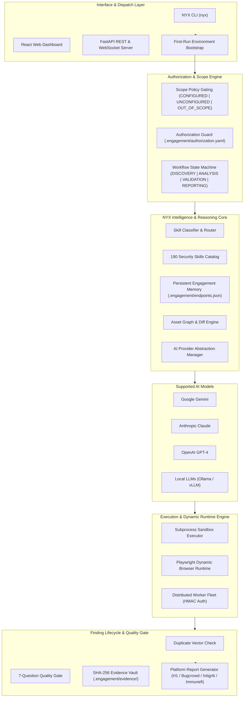

# NYX Security Intelligence Engine

<p align="center">
  
</p>

<p align="center">
  <a href="https://github.com/Omkar443/nyx/blob/main/LICENSE"></a>
  <a href="https://www.python.org/"></a>
  <a href="https://github.com/Omkar443/nyx"></a>
  <a href="https://github.com/Omkar443/nyx"></a>
  <a href="https://github.com/Omkar443/nyx"></a>
  <a href="https://github.com/Omkar443/nyx"></a>
</p>

---

## Overview

**NYX Security Intelligence Engine** (`nyx`) is an open-source, AI-model-neutral security research, threat intelligence, and tool orchestration framework. Designed for senior bug hunters, red-team operators, and application security engineers, NYX transforms raw LLM capabilities into an autonomous security researcher equipped with 190 specialized vulnerability playbooks, persistent engagement memory, SHA-256 evidence verification, and distributed execution nodes.

Whether backed by **Google Gemini**, **Anthropic Claude**, **OpenAI GPT-4**, or **Local LLMs (Ollama / vLLM)**, NYX maintains strict scope boundary enforcement, eliminates false positives through empirical validation gates, and streamlines the full lifecycle from discovery to report generation.

---

## Key Highlights & Pillars

- ⚡ **First-Run Automatic Dependency Bootstrap**: Preflight environment manager detects, installs, and builds Python and Node.js/frontend dependencies automatically across Windows, Linux, and WSL2.
- 🎯 **Explicit Scope Policy Enforcement**: Strict scope validation (`CONFIGURED`, `UNCONFIGURED`, `OUT_OF_SCOPE`). Automatically blocks active execution on unconfigured scopes while allowing safe dry-runs.
- 🛡️ **190 Specialized Security Skills**: Per-vulnerability playbooks covering Web (SQLi, XSS, SSRF, IDOR, LFI, XXE, CORS), API (GraphQL, gRPC, WebSocket), Cloud (AWS, Azure, GCP, IMDS), Enterprise Identity (M365/Entra ID, Okta), Infrastructure (vCenter, SharePoint, Enterprise VPNs), and Mobile Red Teaming (Android APK, iOS IPA).
- 🧠 **AI Model Neutrality**: Unified abstraction layer supporting Gemini, Claude, OpenAI, and Local Ollama / vLLM endpoints with dynamic switching.
- 💾 **Persistent Engagement Memory**: Maintains structured JSON ledgers (`.engagement/`) tracking discovered subdomains, mapped technology stacks, tested attack vectors, and failed hypotheses.
- 🔒 **SHA-256 Cryptographic Evidence Vault**: Stores tamper-evident HTTP request/response logs, screenshots, and console traces with automated PII redaction.
- 🌐 **Distributed Worker Nodes**: Remote execution engine with HMAC-authenticated task dispatch for distributed recon, fuzzing, and surface probes.
- 🌐 **Dynamic Browser Runtime Engine**: Playwright-backed headless browser automation for JavaScript single-page application (SPA) mapping, DOM mutation tracking, and authenticated session state capture.
- 🎯 **7-Question Quality Gate**: Empirical validation workflow that enforces strict proof-of-impact, scope verification, and duplicate check before generating bug bounty reports.

---

## Architecture Flow Diagram



---

## Installation & Quickstart

### Prerequisites
- **Python**: 3.9+ (Windows, Linux, WSL2, or macOS)
- **Node.js**: 18+ (Auto-detected & bootstrapped if missing)

### 1. Editable Installation from Source

```bash
git clone https://github.com/Omkar443/nyx.git
cd nyx
python -m pip install -e .
```

### 2. Verify Environment Health

```bash
nyx doctor
```

*Expected Output:*
```text
======================================================================
NYX Security Intelligence Engine Environment Doctor
======================================================================
System
  OS              ✓ WINDOWS / WSL2 / LINUX
  Architecture    ✓ AMD64

Python
  Version         ✓ 3.14.3
  pip             ✓

Python Packages
  NYX             ✓
  FastAPI         ✓
  Uvicorn         ✓

Frontend
  Node.js         ✓ v24.14.0
  npm             ✓
  Dependencies    ✓
  Build           ✓

Security
  Workspace       ✓ READY
  Configuration   ✓ OK

Loaded Security Skills: 190

Result:
✓ NYX environment is ready
```

---

## Usage Walkthrough

### Step 1: Initialize an Engagement Workspace

```bash
nyx mission init target.com
```

### Step 2: Perform Passive Recon & Surface Ranking

```bash
# Run passive subdomain discovery & HTTP live probing
nyx recon target.com

# Rank the attack surface from recon manifest
nyx surface target.com
```

### Step 3: Classify Target Endpoint to Security Skills

```bash
nyx classify "https://api.target.com/v1/users/42?next=https://evil.com"
```

### Step 4: Run Controlled Tool Execution

```bash
# Dry-run execution on unconfigured or active target
nyx exec subfinder target.com --dry-run
```

### Step 5: Run Quality Gate Triage on a Finding

```bash
nyx triage database/findings/FH-2026-001.md
```

### Step 6: Export Bug Bounty / Client Report

```bash
nyx report database/findings/FH-2026-001.md --platform bugcrowd --out draft.md
```

### Step 7: Launch Web Platform & Dashboard

```bash
# nyx web automatically bootstraps Node.js/frontend dependencies on first launch!
nyx web --port 8000
```

---

## CLI Command Matrix

| Command | Subcommands / Arguments | Description |
|---|---|---|
| `nyx doctor` | None | Verify system, Python environment, skills, frontend build, and workspace readiness |
| `nyx engagement` | `init <target>`, `status`, `export` | Manage persistent target workspace, scope boundaries, and ledger |
| `nyx mission` | `init <target>`, `status`, `run <target>` | Initialize or run automated end-to-end security research missions |
| `nyx recon` | `<target>` | Passive subdomain enumeration, DNS resolution, and live HTTP probing |
| `nyx surface` | `<target>` | Rank attack surface endpoints based on recon manifest data |
| `nyx classify` | `<url>` | Match URL parameters and path structures to the 190 security skills |
| `nyx exec` | `<tool> <target> [--dry-run]` | Policy-gated tool execution harness with scope status validation |
| `nyx memory` | `add`, `search`, `import-burp <file>` | Manage engagement memory ledger and import Burp XML HTTP history |
| `nyx evidence` | `list`, `show <id>`, `verify <id>`, `add` | Manage cryptographic SHA-256 evidence vault items |
| `nyx triage` | `<finding.md>` | Execute the 7-Question Quality Gate triage evaluation |
| `nyx report` | `<finding.md> --platform <h1\|bugcrowd...>` | Generate platform-formatted bug bounty submission drafts |
| `nyx web` | `--port 8000 --host 0.0.0.0` | Launch FastAPI web server & React Dashboard UI (auto-bootstrapped) |
| `nyx monitor` | `start`, `status` | Continuous attack surface monitoring and asset diffing engine |
| `nyx workers` | `list`, `register`, `status`, `run` | Manage & run distributed HMAC-authenticated worker execution nodes |

---

## Supported AI Providers

NYX is completely model-neutral and can be configured with your preferred AI provider:

```bash
# Configure via Environment Variables or .env file
export NYX_AI_PROVIDER="gemini"         # choices: gemini, claude, openai, local
export GEMINI_API_KEY="AIzaSy..."
export ANTHROPIC_API_KEY="sk-ant-..."
export OPENAI_API_KEY="sk-..."
export LOCAL_LLM_URL="http://localhost:11434/v1"
```

---

## Comprehensive Security Skill Catalog (190 Skills)

NYX includes an extensive library of specialized security skills automatically loaded based on context:

| Category | Count | Key Skills & Playbooks |
|---|---|---|
| **Web Application Vulnerabilities** | 13 | `hunt-xss`, `hunt-sqli`, `hunt-ssrf`, `hunt-idor`, `hunt-lfi`, `hunt-ssti`, `hunt-xxe`, `hunt-csrf`, `hunt-cors`, `hunt-open-redirect`, `hunt-html-injection`, `hunt-nosqli`, `hunt-dom` |
| **Authentication & Session** | 7 | `hunt-auth-bypass`, `hunt-session`, `hunt-oauth`, `hunt-saml`, `hunt-mfa-bypass`, `hunt-ato`, `hunt-forgot-password` |
| **API & Protocols** | 15 | `hunt-graphql`, `hunt-grpc`, `hunt-websocket`, `hunt-api-misconfig`, `hunt-host-header`, `hunt-rce`, `hunt-brute-force`, `hunt-captcha-bypass`, `hunt-shadow-api`, `hunt-spa-api`, `hunt-ldap` |
| **Concurrency & Complex** | 6 | `hunt-race-condition`, `hunt-http-smuggling`, `hunt-deserialization`, `hunt-cache-poison`, `hunt-exceptional-conditions`, `hunt-rag-vector` |
| **Framework Specific** | 4 | `hunt-nextjs`, `hunt-nodejs`, `hunt-laravel`, `hunt-springboot` |
| **Enterprise Identity & Cloud** | 3 | `m365-entra-attack`, `okta-attack`, `cloud-iam-deep` |
| **Enterprise Infrastructure** | 4 | `vmware-vcenter-attack`, `enterprise-vpn-attack`, `hunt-sharepoint`, `hunt-aspnet` |
| **Red Team Tradecraft** | 4 | `redteam-mindset`, `apk-redteam-pipeline`, `ios-redteam-pipeline`, `supply-chain-attack-recon` |
| **Recon & OSINT** | 4 | `web2-recon`, `offensive-osint`, `hunt-subdomain`, `recon-scope-triage` |
| **Workflow & Reporting** | 11 | `bb-methodology`, `triage-validation`, `evidence-hygiene`, `report-writing`, `bugcrowd-reporting`, `redteam-report-template`, `mid-engagement-ir-detection`, `security-arsenal`, `web3-audit`, `meme-coin-audit` |

---

## Security Policy, Scope & Authorized-Use Posture

NYX is calibrated specifically for authorized external-perimeter security research, bug bounty hunting, CTFs, and red-team engagements under explicit Rules of Engagement (RoE):

- 🔒 **Target Scope Verification**: Automatically validates `.engagement/target.yaml` and `.engagement/authorization.yaml` before executing active probes. Unconfigured target scopes restrict executions to safe dry-runs.
- 🎯 **7-Question Quality Gate (`nyx triage`)**: Enforces proof-of-impact, accepted program terms, and scope verification before report generation.
- 🛡️ **External Perimeter Focus**: Explicitly excludes internal Active Directory attacks (BloodHound, Kerberoasting, DCSync), C2 frameworks, LSASS dumping, and EDR evasion.
- 🔐 **Cryptographic Evidence Vault (`nyx evidence`)**: Auto-redacts session cookies, authorization headers, and user PII before writing evidence artifacts.

For full details on authorized use, explicit exclusions, supply-chain verification, and responsible disclosure, see the full [NYX Security Policy](SECURITY.md).

---

## Documentation Roadmap

- 📖 [Installation Guide](INSTALL.md)
- 📖 [Usage & Workflow Guide](USAGE.md)
- 📖 [Security Policy & Rules](SECURITY.md)
- 📖 [Contributing Guidelines](CONTRIBUTING.md)
- 📖 [Changelog](CHANGELOG.md)

---

## License & Credits

- **Code License**: [Apache License 2.0](LICENSE)
- **Content License**: [Creative Commons Attribution 4.0 International (CC BY 4.0)](LICENSE-CONTENT)
- **Project Lead & Author**: [Omkar443](https://github.com/Omkar443)

<p align="center">
  <b>NYX Security Intelligence Engine</b> — <i>"Empowering Security Researchers with Autonomous Intelligence & Empirical Rigor."</i>
</p>
