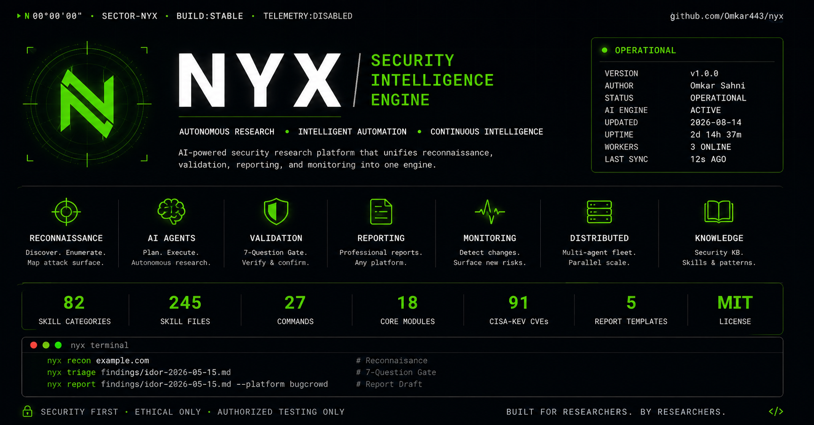
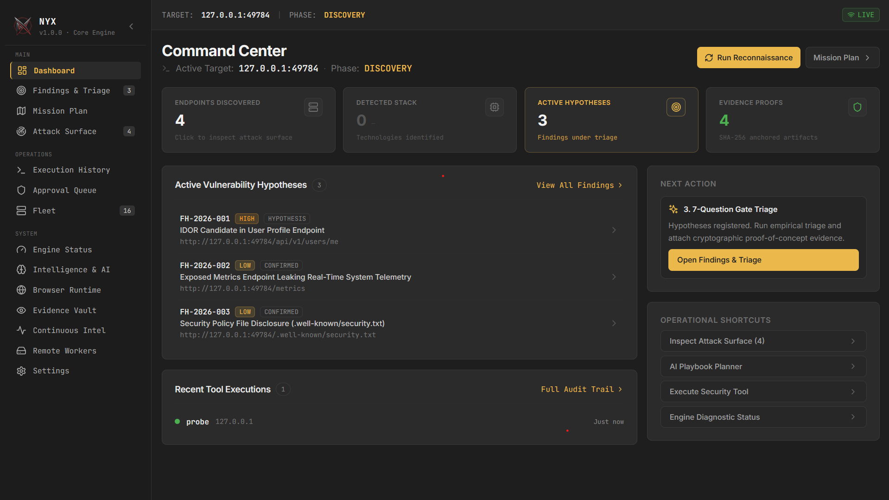

# NYX Security Intelligence Engine

<p align="center">
  
</p>

<p align="center">
  <a href="https://github.com/Omkar443/nyx/blob/main/LICENSE"></a>
  <a href="https://www.python.org/"></a>
  <a href="https://github.com/Omkar443/nyx"></a>
  <a href="https://github.com/Omkar443/nyx"></a>
  <a href="https://github.com/Omkar443/nyx"></a>
  <a href="https://github.com/Omkar443/nyx"></a>
  <a href="docs/benchmarks/"></a>
</p>

---

## What is NYX?

**NYX** (`nyx`) is an open-source **Security Research & Bug Bounty Intelligence Platform** designed for application security engineers, bug bounty hunters, and red teams.

NYX operates as an **advanced reconnaissance, skill-routing, intelligence planning, and human-in-the-loop triage engine** equipped with a native tool execution bridge. Rather than acting as an unconstrained or unsafe "zero-click exploit weapon," NYX combines **83 specialized offensive security skills**, **33 structured domain knowledge databases**, **multi-provider AI advisory reasoning**, **deterministic mission planning**, **real tool execution adapters**, and a strict **7-Question Empirical Validation Gate**.

NYX ensures that every reported finding is backed by **real HTTP request/response traffic, SHA-256 evidence hashing, and strict scope verification**—with **zero fake execution and zero hallucinated bugs**.

---

## Empirical Benchmark Baseline

NYX is evaluated against independently-maintained vulnerable applications with published, objective ground truths across two transparent tiers:

| Benchmark Target | Architecture | Skill Routing Accuracy | Automated Validated Findings | False Positives | Full Methodology |
|---|---|:---:|:---:|:---:|---|
| **OWASP Juice Shop v20.2.0** | Monolithic Node / Express / Angular | **91.7%** (100 / 109) | **12 Findings Confirmed** | **0%** (0 FP) | [docs/benchmarks/juice-shop.md](docs/benchmarks/juice-shop.md) |
| **OWASP crAPI** | Microservices / Reverse Proxy / Multi-DB | **100.0%** (21 / 21) | **8 Findings Confirmed** | **0%** (0 FP) | [docs/benchmarks/crapi.md](docs/benchmarks/crapi.md) |

*Full reproduction command sequences, live finding tables, and ground truth matrices are documented in [docs/benchmarks/](docs/benchmarks/).*

---

## Core Architecture & Invariants

NYX operates on a strict separation of concerns where AI advises, policy governs, deterministic planners schedule, and real evidence validates:

```
┌────────────────────────────────────────────────────────┐
│                   1. CONTEXT ENGINE                    │
│    (Target Domain, Scope Boundaries, Detected Stack)   │
└───────────────────────────┬────────────────────────────┘
                            │
┌───────────────────────────▼────────────────────────────┐
│               2. KNOWLEDGE & SKILL BASE                │
│   (83 Security Skills + 33 Structured Domain YAMLs)    │
└───────────────────────────┬────────────────────────────┘
                            │
┌───────────────────────────▼────────────────────────────┐
│                 3. AI ADVISORY LAYER                   │
│   (Gemini, Grok, Groq, Claude, OpenAI, Local Ollama)   │
│   * Advisory only: Cannot authorize or bypass policy   │
└───────────────────────────┬────────────────────────────┘
                            │
┌───────────────────────────▼────────────────────────────┐
│            4. DETERMINISTIC MISSION PLANNER            │
│   (Context-aware action scheduling & decision graph)   │
└───────────────────────────┬────────────────────────────┘
                            │
┌───────────────────────────▼────────────────────────────┐
│             5. AUTHORIZATION & SCOPE GATE              │
│    (Fail-closed pre-execution policy enforcement)      │
└───────────────────────────┬────────────────────────────┘
                            │
┌───────────────────────────▼────────────────────────────┐
│               6. REAL EXECUTION ADAPTERS               │
│      (httpx, katana, subfinder, ffuf, nuclei, nmap)    │
└───────────────────────────┬────────────────────────────┘
                            │
┌───────────────────────────▼────────────────────────────┐
│            7. EVIDENCE VAULT & VALIDATION              │
│   (SHA-256 Hashing, 7-Question Gate, 8-Class Status)   │
└───────────────────────────┬────────────────────────────┘
                            │
┌───────────────────────────▼────────────────────────────┐
│         8. PERSISTENT ENGAGEMENT MEMORY                │
│   (Tested vectors, finding lifecycle & report drafts)  │
└────────────────────────────────────────────────────────┘
```

### The 10 Security Invariants
1. **AI is Advisory Only:** AI generates hypotheses and reasoning, but cannot directly invoke unapproved shell commands or override scope.
2. **Knowledge is Non-Executable:** Knowledge files provide structured attack patterns and citations without executable code.
3. **Planner is Deterministic:** Mission plans follow strict rule-based trees and historical memory ledgers.
4. **Policy Gate is Authoritative:** Active attacks require explicit authorization (`authorized: true`) and in-scope hosts.
5. **Real Subprocess Execution:** No mock/simulated scan results in production workflows.
6. **Empirical Evidence Required:** Findings require raw HTTP request/response traces or OOB callback logs to be marked `CONFIRMED`.
7. **Infrastructure Failure $
eq$ Negative Security:** Timeouts and connection drops are classified as `failed_infrastructure`, never as "not vulnerable".
8. **Surface Detection $
eq$ Finding Confirmation:** Finding an endpoint (e.g., `/graphql` or `/admin`) never manufactures a vulnerability finding without proof.
9. **Zero-Hallucination Gate:** The 7-Question Gate automatically filters out self-XSS, rate-limit noise, missing best-practice headers, and unproven claims.
10. **100% Repository Independence:** Zero third-party proprietary runtime locks.

---

## Key Features

- 🛡️ **83 Validated Security Skills:** Modular playbooks covering Web, API, Cloud IAM, M365/Entra, Okta, Mobile (APK/iOS), CI/CD, Container/K8s, and Business Logic.
- 🖥️ **Web Operations Dashboard:** Modern React/Vite web platform with live WebSocket streaming, attack surface explorer, multi-agent fleet control, tool execution console, and telemetry monitors.
- 📚 **33 Structured Knowledge Databases:** Verified vulnerability patterns and attack vectors mapped to real-world disclosed bug bounty research.
- 🎯 **Fail-Closed Scope Policy:** Enforces boundary checks (`CONFIGURED`, `UNCONFIGURED`, `OUT_OF_SCOPE`). Blocks active scans on unverified targets while allowing dry-run plan reviews.
- 🔌 **Native Tool Adapters:** Subprocess execution harnesses for `httpx`, `katana`, `subfinder`, `ffuf`, `nuclei`, and `nmap` with Native PATH / WSL dual-vector discovery and timeout isolation.
- 🧠 **Local-First & Multi-Provider AI Abstraction:** Privacy-first **Local LLMs via Ollama** (`qwen2.5-coder:7b`) configured as the default with zero cloud token leaks, no cloud rate limits, and dynamic inference timeout scaling; hot-swappable in real-time via the Web Settings UI or CLI with **Google Gemini**, **Groq**, **xAI Grok**, **OpenAI**, and **Anthropic Claude**.
- 💾 **Persistent Engagement Memory:** Tracks discovered assets, technology stacks, and tested vectors in `.engagement/` to prevent duplicate scanning.
- ⚖️ **Deterministic 7-Question Gate:** Triage engine that scores findings based on real-world impact, unauthenticated reachability, and program terms.
- 📄 **Multi-Platform Report Generator:** Automatically drafts formatted vulnerability submissions for **HackerOne**, **Bugcrowd**, **Intigriti**, and enterprise red-team deliverables.

---

## Installation & Quickstart

### 1. One-Command Automated Setup (Recommended)

NYX includes an interactive, idempotent onboarding wizard that detects your OS, installs and validates dependencies, builds the frontend, and tests your AI provider before writing configuration:

```bash
# Clone the repository
git clone https://github.com/Omkar443/nyx.git
cd nyx

# Run the automated installer (Linux, macOS, WSL)
./install.sh
```

*Alternatively on any platform with Python 3.11+:*
```bash
python3 setup.py
# or anytime via CLI after install:
nyx setup
```

#### What the installer automatically handles:
- **Python Runtime & Packages**: Validates Python >= 3.11, installs all core and web dependencies via `pip install -e .[all]`.
- **Node.js & Web Dashboard**: Detects Node.js and npm, installs frontend dependencies, and compiles the production bundle (`frontend/dist/index.html`).
- **Security Tools**: Auto-installs `sqlmap` via pip if missing; auto-installs `nuclei` and `ffuf` via `go install` if the Go runtime is detected in PATH.
- **Interactive AI Provider Configuration**: Prompts for your AI provider, collects API keys via hidden/masked input, **tests live connectivity before saving**, and safely writes to `.env` (automatically creating a `.env.backup.<timestamp>` backup).
- **Ethical Authorization Protocol**: Sets up the initial `.engagement/` workspace structure after explicit consent confirmation.
- **Post-Install Validation**: Runs core unit test suite and provider health checks.
- **Idempotency**: Safe to re-run at any time—already-installed runtimes, compiled frontend bundles, and tools are detected and skipped cleanly.

#### Manual Prerequisites (if not already installed):
- **Go Runtime (Optional for Go tools)**: If building `nuclei` or `ffuf` from source, install Go (`sudo apt install golang` or from https://go.dev/dl/). Precompiled binaries placed in system PATH are also auto-detected.
- **SecLists Wordlists (Optional for ffuf)**: Detected at `/usr/share/seclists` (install via `sudo apt install seclists` on Debian/Kali/Ubuntu, or clone to `~/.local/share/seclists`).

---

### 2. Manual Installation (Fallback)

If you prefer manual setup without the interactive wizard:

```bash
# 1. Install Python dependencies
python3 -m pip install -e ".[all]"

# 2. Build the React Web Dashboard
cd frontend
npm install
npm run build
cd ..

# 3. Configure environment variables (.env)
cp .env.example .env  # Or create .env with your AI keys

# 4. Verify system environment
nyx doctor
```

---

## Standard Workflow

### Step 1: Initialize an Engagement Workspace

```bash
nyx engagement init target.com
```

### Step 2: Configure Authorization & Scope

Inspect `.engagement/target.yaml` and confirm authorized boundaries in `.engagement/authorization.yaml`:

```yaml
# .engagement/authorization.yaml
authorized: true
mode: "RESEARCH"
```

### Step 3: Run Passive Recon & Surface Ranking

```bash
# Discover subdomains, unlinked paths, and SPA JS API endpoints
nyx recon target.com

# Rank attack surfaces based on discovered routes
nyx surface target.com
```

### Step 4: Classify Endpoints Against Security Skills

```bash
nyx classify "https://api.target.com/v1/graphql"
```

### Step 5: Automated Intelligence Planning & Native Mission Execution

NYX supports both modular step planning and unified multi-phase mission execution with an automated `ExecutionFindingBridge`:

```bash
# Option A: Generate an advisory AI/deterministic plan
nyx ai plan target.com

# Option B: Execute an end-to-end multi-agent security assessment
# Automatically orchestrates Discovery, Analysis, Tool Execution, Evidence Vaulting, and 7-Question Validation:
nyx run-mission target.com
```

*When tools execute via the native pipeline, raw HTTP traffic traces are captured and bridged directly into `.engagement/evidence/` with SHA-256 integrity hashes, and automatically evaluated against the 7-Question Gate.*

### Step 6: Inspect Evidence & Triage Findings

```bash
# List verified findings on disk
nyx findings

# Inspect cryptographic evidence in the vault
nyx evidence list FH-2026-001
nyx evidence verify EV-2026-0001

# Manually evaluate empirical evidence through the 7-Question Quality Gate
nyx triage .engagement/findings/FH-2026-001/finding.json
```

### Step 7: Export Submission-Ready Report

```bash
# Export platform-formatted report (choices: h1, bugcrowd, intigriti, immunefi, redteam)
nyx report FH-2026-001 --platform bugcrowd --out draft_report.md
```

### Step 8: Launch the Web Dashboard

```bash
nyx web --port 8000
```

---

## 🖥️ Web Operations Dashboard

NYX includes a built-in, real-time web operations dashboard built with **React**, **TypeScript**, **Tailwind CSS**, and **FastAPI WebSocket Streaming**.

<p align="center">
  
</p>

### Launching the Dashboard

Start the backend server and embedded web interface:

```bash
# Launch on default port (http://localhost:8000)
nyx web --port 8000

# Custom host and port (e.g. for remote or team environments)
nyx web --host 0.0.0.0 --port 8000
```

Once launched:
- 🌐 **Web Dashboard UI**: `http://localhost:8000`
- ⚡ **WebSocket Live Event Stream**: `ws://localhost:8000/ws/events`
- 📖 **Interactive API Documentation (Swagger)**: `http://localhost:8000/api/docs`

### Dashboard Views & Core Capabilities

The NYX Web UI provides a centralized interface for the entire research lifecycle:

| View | Purpose & Key Features |
|---|---|
| **🎯 Security Overview (Dashboard)** | Real-time target context, engagement phase, discovered endpoints, active vulnerability hypotheses, stack detection, and recent tool executions. |
| **🛡️ Findings & 7-Question Triage** | Live findings ledger, empirical evidence inspector, CVSS 3.1 & VRT category mapping, and single-click report generation for HackerOne, Bugcrowd, and Intigriti. |
| **🗺️ Deterministic Mission Planner** | Context-aware decision trees, automated step execution, and strategy formulation across discovery, analysis, and validation phases. |
| **📡 Attack Surface Explorer** | Discovered endpoint inventory, route priority ranking, query parameter mapping, and technology detection. |
| **💻 Execution History & Tool Harness** | Live process launcher with Native PATH & WSL dual-vector discovery (`httpx`, `subfinder`, `katana`, `nuclei`, `nmap`, `ffuf`, `curl`), live output streaming, and honest execution status badges (`COMPLETED`, `SKIPPED`, `UNAVAILABLE`, `BLOCKED`, `FAILED`). |
| **👥 Multi-Agent Fleet & Approvals** | Sequential HITL approval queue with upcoming pipeline preview accordion ("Step X of Y · N more queued"), interactive authorization modals, and autonomous worker control. |
| **⚡ Engine Telemetry & System Health** | Live runtime telemetry, dynamic 83-skill inventory distribution, binary resolution matrix, worker status, and persistent vault integrity. |
| **🧠 Intelligence & AI Playbooks** | Multi-provider AI reasoning, vulnerability playbook generator, knowledge base search, and provider readiness checks. |
| **👁️ Evidence Vault** | Raw HTTP request/response logs with SHA-256 integrity verification, PII redaction, and reproducible PoC records. |
| **📈 Continuous Monitoring** | Scheduled cron monitoring jobs, new asset diff detection, and automated alerting. |
| **⚙️ Target & Scope Settings** | Engagement target configuration, in-scope whitelist domains/IPs, exclusion rules, and **real-time AI Provider Switcher** (hot-swap between Local Ollama, Gemini, Groq, Grok, OpenAI, and Claude). |

---

## Supported AI Providers & Local-First Architecture

NYX is built with a **local-first, privacy-respecting architecture**. By default, NYX performs all strategic planning, hypothesis generation, finding enrichment, and 7-Question triage using a self-hosted **Local LLM via Ollama** (`qwen2.5-coder:7b`), ensuring that no target data, internal IP addresses, API schemas, or customer tokens ever leave your machine.

NYX is also completely model-neutral and includes a **real-time Provider Switcher** in both the Web Operations Dashboard (under **Settings**) and the CLI (`--provider <name>`). You can seamlessly hot-swap between local models and commercial cloud APIs without restarting the server or losing mission context.

| Provider | Identifier | Default Model | Best For | Privacy & Quotas |
|---|---|---|---|---|
| **Local LLM (Ollama)** *(Default & Recommended)* | `local` | `qwen2.5-coder:7b` | Offline research, zero cloud data leakage, autonomous loop | Unlimited local execution; zero cloud tokens |
| **Google Gemini** | `gemini` | `gemini-2.5-flash` | Fast hosted analysis, broad context window | Standard Google API quotas |
| **Groq** | `groq` | `openai/gpt-oss-120b` | High-speed structured advisory reasoning | Free-tier TPM/daily token limits apply |
| **xAI Grok** | `grok` | `grok-2` | Specialized reasoning & deep analysis | Standard xAI API billing |
| **OpenAI** | `openai` | `gpt-4o` | High-accuracy triage review | Standard OpenAI API billing |
| **Anthropic Claude** | `claude` | `claude-3-5-sonnet` | Complex code & parameter analysis | Standard Anthropic API billing |

### Default Configuration (`.env`)

```bash
# Primary active provider (local, gemini, groq, grok, openai, claude)
NYX_AI_PROVIDER="local"
NYX_PREFER_LOCAL="true"

# Local Ollama Configuration (Default)
LOCAL_LLM_MODEL="qwen2.5-coder:7b"
LOCAL_LLM_URL="http://localhost:11434/api/generate"

# Token Budgets & Dynamic Timeout Settings
LOCAL_MAX_TOKENS="1000"
LOCAL_MAX_TOKENS_PLANNING="1024"
LOCAL_MAX_TOKENS_ENRICHMENT="1000"
LOCAL_MAX_TOKENS_TRIAGE="1200"
LOCAL_MAX_TOKENS_EVALUATION="800"
LOCAL_TIMEOUT_PADDING="60"

# Optional Cloud Provider Credentials (configure only if using cloud switching)
GEMINI_API_KEY=""
GROQ_API_KEY=""
XAI_API_KEY=""
OPENAI_API_KEY=""
ANTHROPIC_API_KEY=""
```

*Note: If no AI provider is reachable, NYX automatically falls back to its deterministic rule engine with 100% core scanning functionality preserved.*

---

## Sequential Human-in-the-Loop (HITL) Execution & Pipeline Preview

NYX enforces a strict operational taxonomy to guarantee safety, reproducibility, and human accountability:

```
                      ┌─────────────────────────────────┐
                      │    PASSIVE / NON-DESTRUCTIVE    │
                      │  (Autonomous — No Approval Req) │
                      └────────────────┬────────────────┘
                                       │
                      ┌────────────────▼────────────────┐
                      │   1. Passive Recon & Discovery  │
                      │   2. Tech Stack Fingerprinting  │
                      │   3. Router & URL Classification│
                      │   4. Hypothesis Generation      │
                      └────────────────┬────────────────┘
                                       │
            ┌──────────────────────────┴──────────────────────────┐
            ▼                                                     ▼
┌───────────────────────────────┐             ┌───────────────────────────────┐
│     ACTIVE / DESTRUCTIVE      │             │        NOT YET BUILT          │
│ (Requires Human Authorization)│             │          (v2 Scope)           │
├───────────────────────────────┤             ├───────────────────────────────┤
│ • sqlmap active injection     │             │ • AI-generated custom exploits│
│ • nuclei active template fuzz │             │ • Zero-day payload synthesis  │
│ • ffuf parameter/LFI fuzzing  │             │ • Automated multi-stage chains│
│                               │             │                               │
│ Approval Flow:                │             │ *NYX orchestrates vetted tools│
│   CLI: nyx agent approve <id> │             │  (nuclei/sqlmap/ffuf), not    │
│   Web: 1-click Approval Modal │             │  untested generated scripts.  │
└───────────────────────────────┘             └───────────────────────────────┘
```

### Why HITL Approvals Are Sequential
In the NYX autonomous loop, candidate steps are **dynamically evaluated after each execution cycle**. Rather than executing a static, pre-baked batch of attacks upfront, each iteration incorporates real evidence discovered by earlier steps. 

When a destructive action (such as `nuclei`, `sqlmap`, or `ffuf`) is selected:
1. **Loop Pauses Safely**: The autonomous loop pauses and creates an approval request.
2. **Sequential Progress Indicator**: The Web Dashboard and CLI indicate:
   ```text
   Step 2 of 5 · 3 more destructive steps queued
   ```
3. **Upcoming Pipeline Preview**: An interactive accordion in the dashboard displays the preview of upcoming planned steps, their tools, targets, and justifications, giving the operator complete situational awareness before authorizing.
4. **Execution & Next Evaluation**: Once approved, the tool executes, findings and evidence are harvested, and the planner dynamically recalculates remaining steps.

### Auto-Approve Mode (Optional Per-Mission Automation)
For high-velocity authorized testing or unattended CI/CD runs, NYX provides an optional **Auto-Approve Mode**:
- **Per-Mission Toggle (Default OFF)**: Configurable directly on the Autonomous Mission Runner UI. Manual human approval remains the strict, permanent default.
- **Mandatory Confirmation Modal**: Enabling Auto-Approve requires confirming a safety dialog explaining that destructive actions (`nuclei`, `sqlmap`, `ffuf`) will execute automatically without human pause.
- **Immutable Audit Trail**: Auto-approved actions are recorded in `.engagement/approval_history.json` and in telemetry with `approved_by: "auto"`, preserving a complete audit ledger identical to human operator approvals.
- **Live Visual Safeguards**: While active, the UI renders a dedicated amber warning header with an `AUTO-APPROVE ACTIVE` badge and real-time execution controls.

### Real-Time Mission Tracking & Tab-Switch Re-hydration
NYX features an authoritative **Active Mission Tracker** singleton backed by `GET /api/v1/ai/autonomous-status`:
- **Authoritative Backend State**: Tracks `is_running`, `last_progress`, `elapsed_seconds`, `auto_approve`, `active_permitted`, and pending approvals across the full mission lifecycle.
- **Zero-Loss Tab Switching**: When an operator navigates away from the Mission Plan tab or refreshes the page, the frontend automatically queries `/api/v1/ai/autonomous-status` upon remount and re-hydrates live execution state, elapsed timers, and console logs, eliminating false "idle" UI states while background missions continue executing.

### Phase Auto-Tracking & Live Telemetry
As the mission progresses, NYX automatically advances the engagement state through the standard lifecycle:
`DISCOVERY` ──► `ANALYSIS` ──► `VALIDATION` ──► `REPORTING`

All phase transitions, step completions, and approval state changes are streamed live via WebSocket (`ws://localhost:8000/ws/events`) to the frontend in real time.

### Fail-Closed Behavior on AI Outage
When operating in autonomous mode, if an AI provider fails (due to connection dropouts, HTTP 429 quota exhaustion, or unparseable output), **the mission loop halts immediately with status `ai_unavailable`**. NYX will **never** silently fall back to guessing, will **never** manufacture unverified findings during an outage, and preserves all previously collected data in `.engagement/`.

---

## Multi-Target Workspace Isolation Guarantees

NYX guarantees strict data isolation across different targets:

- **Target-Bound Context Engine**: Intelligence assets—including endpoint catalogs (`endpoints.json`), detected technologies (`technologies.json`), tested attack vectors (`tested_vectors.json`), and vulnerability hypotheses (`findings.json`)—are bound directly to the active target domain specified in `.engagement/target.yaml`.
- **Zero Cross-Contamination**: When switching targets, tested vector history and finding records are strictly filtered by target provenance. Probing or validating Target A will never falsely register as completed vectors for Target B, and findings from Target B will never appear in Target A's triage pipeline or report drafts.

---

## Hardware & Load Considerations (Performance & Contention)

Local LLM inference speed depends directly on available GPU/CPU compute resources:

- **Baseline Inference Speed**: On standard modern hardware (e.g., Apple Silicon M-series or NVIDIA RTX 30/40 series GPUs), 7B parameter models such as `qwen2.5-coder:7b` typically achieve **4.0 to 6.0 tokens/second**.
- **System Contention (OBS / Screen Recording / Heavy Multi-Tasking)**: When running concurrent GPU/CPU intensive applications—such as OBS screen recording, hardware video encoding, or background rendering—local inference throughput can temporarily drop to **1.5 to 3.0 tokens/second**.
- **Dynamic Adaptive Timeout Scaling**: NYX incorporates an intelligent throughput calibrator. Rather than relying on a brittle static timeout, NYX measures generation speed in real-time and dynamically scales request timeouts based on the token budget:
  $$\text{Timeout} = \left(\frac{\text{Token Budget}}{\text{Calibrated Speed}}\right) + \text{Padding}$$
  Under heavy contention (e.g., 4.5 tok/s with a 1,024-token budget), NYX automatically extends request timeouts to ~290–370s, ensuring that autonomous missions never abort prematurely due to background system load.

---

## Complete Environment Variable Reference

All configuration options can be set in your `.env` file or exported into the system environment:

| Variable | Default | Description |
|---|---|---|
| `NYX_AI_PROVIDER` | `local` | Primary AI provider (`local`, `gemini`, `groq`, `grok`, `openai`, `claude`). |
| `NYX_PREFER_LOCAL` | `true` | Prefer local Ollama inference whenever the local server is reachable. |
| `LOCAL_LLM_MODEL` | `qwen2.5-coder:7b` | Model tag to load via Ollama for local inference. |
| `LOCAL_LLM_URL` | `http://localhost:11434/api/generate` | Full HTTP endpoint URL for Ollama generation API. |
| `LOCAL_MAX_TOKENS` | `1000` | Baseline maximum token ceiling for local generations. |
| `LOCAL_MAX_TOKENS_PLANNING` | `1024` | Dedicated token budget for strategic mission plan formulation. |
| `LOCAL_MAX_TOKENS_ENRICHMENT`| `1000` | Dedicated token budget for vulnerability hypothesis enrichment. |
| `LOCAL_MAX_TOKENS_TRIAGE` | `1200` | Dedicated token budget for 7-Question Gate finding validation reviews. |
| `LOCAL_MAX_TOKENS_EVALUATION`| `800` | Dedicated token budget for empirical evidence review evaluations. |
| `LOCAL_TIMEOUT_PADDING` | `60` | Safety padding (in seconds) added to dynamically calculated local LLM timeouts. |
| `GEMINI_API_KEY` | *(None)* | Google AI Studio API key for Gemini models (`gemini-2.5-flash`). |
| `GROQ_API_KEY` | *(None)* | Groq Cloud API key for ultra-fast hosted inference. |
| `XAI_API_KEY` | *(None)* | xAI API key for Grok models (`grok-2`). |
| `OPENAI_API_KEY` | *(None)* | OpenAI API key for GPT-4o models. |
| `ANTHROPIC_API_KEY` | *(None)* | Anthropic API key for Claude 3.5 Sonnet. |
| `NYX_WEB_HOST` | `127.0.0.1` | Host address for the NYX Web Operations Dashboard server. |
| `NYX_WEB_PORT` | `8000` | Port number for the NYX Web Operations Dashboard server. |
| `NYX_BURP_PROXY` | *(None)* | Proxy URL (e.g. `http://127.0.0.1:8080`) for upstream Burp Suite interception (disables TLS verification for lab targets). |
| `HTTPS_PROXY` / `HTTP_PROXY` | *(None)* | Standard corporate proxy URL (preserves strict TLS verification). |

---

## Tool Coverage & Validation Menu

NYX pairs deterministic parameter and routing classifications with specialized, industry-standard verification adapters:

| Vulnerability Class | Primary Tool | Secondary / Fallback | Selection & Verification Method |
|---|---|---|---|
| **SQL Injection (SQLi)** | `sqlmap` | `nuclei` (`-tags sqli`) | Parameter input detection -> least-invasive boolean/error probes first; data dumping requires explicit engagement authorization |
| **Local File Inclusion (LFI) / Traversal** | `ffuf` | `nuclei` (`-tags lfi`) | Stack-aware wordlist fuzzing with deterministic regex verification (`root:x:0:0`, PHP fatal errors) |
| **Command Injection (RCE)** | `nuclei` (`-tags rce,oast`) | Manual CLI | System parameter & utility detection (`cmd`, `exec`, `ping`, `dns-lookup`) |
| **Cross-Site Scripting (XSS)** | `nuclei` (`-tags xss`) | Manual inspection | Reflection surface & blog/content parameter analysis |
| **Authentication & Session Flaws** | `nuclei` (`-tags auth,jwt`) | Manual inspection | Login, registration, token exchange, and account recovery flows |
| **SSRF & Open Redirects** | `nuclei` (`-tags ssrf,redirect`) | OOB callback | URL redirect parameter routing (`url=`, `redirect=`, `dest=`) |
| **GraphQL Introspection & IDOR** | `nuclei` (`-tags graphql,idor`) | Custom queries | Query schema introspection & object identifier routing |

*Coverage Note: Template-based and signature-based validation can only verify vulnerabilities with known matching signatures. Legitimate potential vulnerabilities without pre-existing automated templates remain honestly categorized as `HYPOTHESIS` pending researcher verification.*

---

## Evidence Vault & Finding Lifecycle Model

NYX manages findings through a rigorous, unidirectional 6-state lifecycle backed by cryptographic evidence and two layers of false-positive defense:

```
  [HYPOTHESIS] ──► [TRIAGED] ──► [VALIDATING] ──► [CONFIRMED] ──► [REPORTED]
        │              │               │                 │
        └──────────────┴───────────────┴─────────────────┴──────► [REJECTED]
```

### Finding Lifecycle States:
- **`HYPOTHESIS`**: Surface pattern matched via classification or AI reasoning. Contains structured technical observations (why flagged, preconditions for exploitability, verification steps).
- **`TRIAGED`**: Passed initial scope and sanity filters.
- **`VALIDATING`**: Active verification probe proposed or in-flight with human authorization.
- **`CONFIRMED`**: Verified with empirical HTTP evidence passing both adapter-level content validation and AI evidence review.
- **`REJECTED`**: Confirmed as false positive, out of scope, or non-exploitable.
- **`REPORTED`**: Exported to submission-ready markdown (HackerOne, Bugcrowd, Intigriti, Red Team).

### Two-Layer False-Positive Defense:
1. **Deterministic Tool-Adapter Verification**: Tool adapters enforce content signatures (e.g. `ffuf` requires actual `/etc/passwd` structure or error signatures rather than status-code-only matches, with baseline response diffing).
2. **AI Evidence Review**: Raw HTTP response output is submitted to AI advisory review to evaluate empirical validity before any finding can be marked `CONFIRMED`.

---

## Security Skill Catalog (83 Validated Skills)

| Domain | Count | Key Skills & Playbooks |
|---|:---:|---|
| **Web Application Vulnerabilities** | 13 | `hunt-xss`, `hunt-sqli`, `hunt-ssrf`, `hunt-idor`, `hunt-lfi`, `hunt-ssti`, `hunt-xxe`, `hunt-csrf`, `hunt-cors`, `hunt-open-redirect`, `hunt-html-injection`, `hunt-nosqli`, `hunt-dom` |
| **Authentication & Identity** | 7 | `hunt-auth-bypass`, `hunt-session`, `hunt-oauth`, `hunt-saml`, `hunt-mfa-bypass`, `hunt-ato`, `hunt-forgot-password` |
| **API & Modern Protocols** | 11 | `hunt-graphql`, `hunt-grpc`, `hunt-websocket`, `hunt-api-misconfig`, `hunt-host-header`, `hunt-rce`, `hunt-brute-force`, `hunt-captcha-bypass`, `hunt-shadow-api`, `hunt-spa-api`, `hunt-ldap` |
| **Concurrency & Complex Vectors** | 6 | `hunt-race-condition`, `hunt-http-smuggling`, `hunt-deserialization`, `hunt-cache-poison`, `hunt-exceptional-conditions`, `hunt-rag-vector` |
| **Framework Specific** | 4 | `hunt-nextjs`, `hunt-nodejs`, `hunt-laravel`, `hunt-springboot` |
| **Enterprise Identity & Cloud** | 3 | `m365-entra-attack`, `okta-attack`, `cloud-iam-deep` |
| **Enterprise Infrastructure** | 4 | `vmware-vcenter-attack`, `enterprise-vpn-attack`, `hunt-sharepoint`, `hunt-aspnet` |
| **Red Team Tradecraft & Mobile** | 4 | `redteam-mindset`, `apk-redteam-pipeline`, `ios-redteam-pipeline`, `supply-chain-attack-recon` |
| **Recon & OSINT** | 4 | `web2-recon`, `offensive-osint`, `hunt-subdomain`, `recon-scope-triage` |
| **DeFi & Smart Contracts** | 2 | `web3-audit`, `meme-coin-audit` |
| **Methodology & Quality Assurance** | 11 | `bb-methodology`, `triage-validation`, `evidence-hygiene`, `report-writing`, `bugcrowd-reporting`, `redteam-report-template`, `mid-engagement-ir-detection`, `security-arsenal`, `hunt-dispatch`, `hunt-misc`, `hunt-fintech-graphql` |
| **Infrastructure & Cloud Config** | 3 | `hunt-cloud-misconfig`, `hunt-k8s`, `hunt-cicd` |
| **Network & Directory Surface** | 3 | `hunt-tls-network`, `hunt-ntlm-info`, `hunt-source-leak` |
| **Total Validated Skills** | **83** | **100% Passing Skill Linter (0 errors)** |

---

## Test Suite & Verification

NYX is backed by an automated regression test suite covering all security domains, policy enforcement gates, setup wizards, and AI providers:

```bash
python3 -m pytest
```

### Fast Test Execution via `NYX_MOCK_LLM` (Developer / Testing Tier)
To ensure fast, reliable local development and CI runs without requiring real GPU/CPU local LLM inference or commercial API keys, the test suite defaults to deterministic mock AI reasoning via `NYX_MOCK_LLM=1` in `conftest.py`:
- **Blazing Fast**: Runs all 341 tests in ~3.5 minutes (down from 31+ minutes when contending on real local model inference).
- **Zero Overhead**: Completely eliminates live network requests to `http://localhost:11434` during routine unit/regression testing.
- **Live LLM Opt-In**: To run the test suite against a real local Ollama server, pass the `--live-llm` flag:
  ```bash
  pytest --live-llm
  ```
- **Test-Only Isolation**: `NYX_MOCK_LLM` is strictly a test-time environment gate configured via `conftest.py`. It is never enabled in `.env`, production configs, CLI commands, or web server runtime paths.

---

## Verified Benchmarks & Empirical Methodology

To ensure transparent and falsifiable evaluation, NYX is tested against benchmark targets using full CLI automation (zero manual file edits or synthetic modifications):

### 1. Mutillidae Front-Controller Benchmark (Tested August 2026)
- **Target**: `https://server.vulnapp.id/mutillidae/` (PHP Front-Controller Architecture)
- **Methodology**: Full autonomous mission loop (`nyx ai autonomous <target> --provider groq --max-iterations 30`) with query-router target extraction.
- **Results**: Discovered 56 live endpoints, mapped 130 router paths, and generated **27 structured hypotheses** across SQLi (`user-info.php`, `show-log.php`), Command Injection (`dns-lookup.php`), Stored/Reflected XSS (`add-to-your-blog.php`), LFI (`arbitrary-file-inclusion.php`), and Authentication.

### 2. Standard Benchmark Suites
- **OWASP Juice Shop v20.2.0**: **100 / 109** actionable attack surfaces routed (**91.7%**), **12 automated findings confirmed on disk/dashboard** ([docs/benchmarks/juice-shop.md](docs/benchmarks/juice-shop.md)).
- **OWASP crAPI**: **21 / 21** actionable attack surfaces routed (**100.0%**), **8 automated findings confirmed on disk/dashboard** ([docs/benchmarks/crapi.md](docs/benchmarks/crapi.md)).

---

## Known Limitations

- **Frontend Automated Test Coverage**: Frontend React components are currently verified through manual end-to-end testing; full automated browser test suite (Playwright/Cypress) is planned for a future release.
- **Custom Exploit Synthesis (v2 Scope)**: NYX does not construct bespoke exploit binaries or novel RCE payloads; it executes vetted security tooling (`nuclei`, `sqlmap`, `ffuf`).
- **AI Quota Latency Trade-offs**: Cloud providers (e.g. Groq free tier) provide fast hosted inference but enforce strict TPM quotas; local providers (`local` / Ollama) provide unlimited offline execution with hardware-dependent latency (mitigated by NYX's real-time throughput calibration and dynamic timeout scaling).
- **Template Coverage Gaps**: Complex multi-stage business logic or exotic vulnerabilities lacking public Nuclei templates will remain in `HYPOTHESIS` status until manually confirmed by a researcher.

---

## Responsible Use & Security Policy

NYX is built strictly for **authorized security research, defensive posture evaluation, bug bounty programs, and authorized penetration testing**:

- **Authorization Gate:** Active scans require verified ownership or explicit written authorization (`authorized: true` in `.engagement/authorization.yaml`).
- **Privacy & Hygiene:** Session cookies, Authorization headers, and sensitive customer PII are automatically redacted before evidence storage.
- **Out-of-Scope Exclusions:** NYX explicitly rejects internal Active Directory credential dumping, malware delivery, and EDR disruption tradecraft.

For vulnerability reporting, see [SECURITY.md](SECURITY.md). For contribution guidelines, see [CONTRIBUTING.md](CONTRIBUTING.md).

---

## License

- **Source Code**: [Apache License 2.0](LICENSE)
- **Security Knowledge & Content**: [Creative Commons Attribution 4.0 International (CC BY 4.0)](LICENSE-CONTENT)
- **Author & Maintainer**: [Omkar](https://github.com/Omkar443)

<p align="center">
  <b>NYX Security Intelligence Engine</b> — <i>"Empowering Security Researchers with Autonomous Intelligence & Empirical Rigor."</i>
</p>
